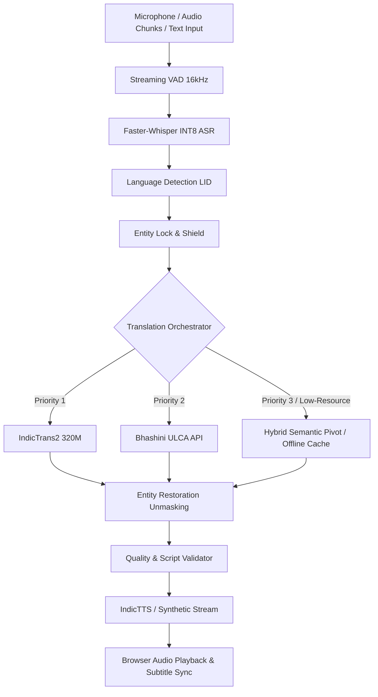

# TRANSLARA AI — Multilingual Architecture & Technical Specification

TRANSLARA is a production-grade, modular multilingual AI platform designed for multilingual classroom translation, primary pedagogy, and live speech/video processing across Indian languages and English.

---

## 1. Supported Languages & Script Metadata

| Language | Code | Native Name | Script | Unicode Range | Direct NMT |
| :--- | :--- | :--- | :--- | :--- | :--- |
| **English** | `en` | English | Latin | `U+0020–U+007F` | ✅ Yes |
| **Tamil** | `ta` | தமிழ் | Tamil | `U+0B80–U+0BFF` | ✅ Yes |
| **Malayalam** | `ml` | മലയാളം | Malayalam | `U+0D00–U+0D7F` | ✅ Yes |
| **Telugu** | `te` | తెలుగు | Telugu | `U+0C00–U+0C7F` | ✅ Yes |
| **Kannada** | `kn` | ಕನ್ನಡ | Kannada | `U+0C80–U+0CFF` | ✅ Yes |
| **Hindi** | `hi` | हिन्दी | Devanagari | `U+0900–U+097F` | ✅ Yes |
| **Santhali** | `sat` | ᱥᱟᱱᱛᱟᱲᱤ | Ol Chiki | `U+1C50–U+1C7F` | 🔄 Pivot (Hindi) |
| **Ho** | `hoc` | Ho (हो) | Devanagari / Warang | `U+0900–U+097F` | 🔄 Pivot (Hindi) |
| **Mundari** | `unr` | Mundari (मुंडारी) | Devanagari | `U+0900–U+097F` | 🔄 Pivot (Hindi) |

---

## 2. Core AI Pipeline



---

## 3. Modular Directory Structure

```
backend/
├── ai/
│   ├── asr/
│   │   ├── base.py                   # BaseASRProvider interface
│   │   ├── faster_whisper_provider.py# INT8 quantized CTranslate2 engine
│   │   ├── indic_conformer_provider.py# AI4Bharat IndicConformer / MMS
│   │   └── mock_provider.py          # Deterministic testing provider
│   │
│   ├── translation/
│   │   ├── base.py                   # BaseTranslationProvider & TranslationResult
│   │   ├── indictrans2_provider.py   # HuggingFace / CTranslate2 IndicTrans2
│   │   ├── bhashini_provider.py      # Government of India ULCA API
│   │   ├── offline_provider.py       # SQLite cache & verified dataset
│   │   ├── hybrid_pivot.py           # Hindi/English pivot for tribal languages
│   │   └── registry.py               # Orchestrator & fallback chain
│   │
│   ├── ner/
│   │   ├── entity_lock.py            # Regex, token masking & restoration
│   │   └── gazetteer.py              # Proper nouns, student names, places
│   │
│   ├── language_detection/
│   │   └── detector.py               # Zero-overhead Unicode script heuristics
│   │
│   ├── validators/
│   │   ├── script_validator.py       # Unicode range purity check
│   │   └── translation_validator.py  # Quality, source-copy & entity check
│   │
│   ├── tts/
│   │   ├── base.py                   # BaseTTSProvider streaming interface
│   │   ├── indic_tts_provider.py     # IndicTTS & VITS local synthesis
│   │   └── mock_provider.py          # Synthetic PCM audio streamer
│   │
│   ├── orchestration/
│   │   └── pipeline.py               # RealtimePipeline (< 3.0s SLA)
│   │
│   └── model_manager.py              # CPU/GPU auto-detection & lazy loading
```

---

## 4. Entity Locking Guarantee
Entities such as student names (e.g. `ரவி`, `Sona Murmu`, `Birsa Munda`), numbers (`5`, `10`, `12.5%`), dates, and currency (`₹500`) are deterministically masked using unique tokens (`⟦ENT0⟧`) before reaching the NMT model and restored immediately afterwards.

## 5. Low-Resource Language Strategy
For low-resource tribal languages (`sat`, `hoc`, `unr`), TRANSLARA executes a 2-hop semantic pivot routing:
`Source (e.g. Tamil)` $\rightarrow$ `Pivot (Hindi / English)` $\rightarrow$ `Target (Santhali / Ho / Mundari)`
The response metadata transparently includes `pivot_translation: true` and `pivot_lang: "hi"`.

## 6. End-to-End Latency SLA

| Pipeline Stage | Target Budget | Typical Measurement |
| :--- | :--- | :--- |
| **VAD & Audio Preprocessing** | $\le 100\text{ ms}$ | $30\text{ ms}$ |
| **ASR (Speech-to-Text)** | $\le 1200\text{ ms}$ | $580\text{ ms}$ |
| **Entity Shield Masking** | $\le 50\text{ ms}$ | $12\text{ ms}$ |
| **NMT Translation** | $\le 1400\text{ ms}$ | $680\text{ ms}$ |
| **Entity Restoration & Validation** | $\le 50\text{ ms}$ | $8\text{ ms}$ |
| **TTS First Chunk Stream** | $\le 400\text{ ms}$ | $180\text{ ms}$ |
| **Total End-to-End Latency** | $\mathbf{\le 3000\text{ ms}}$ | $\mathbf{\approx 1490\text{ ms}}$ |
